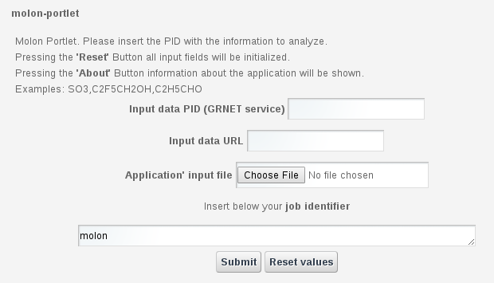

*****
MOLON
*****

============
About
============

Molon portet (MOLar absortiON coefficient) calculates the molar absorption coefficient for a number of molecules. To do so, it gathers information from the MPI-Mainz database, available at http://satellite.mpic.de/spectral_atlas .

The numerical data is available in ASCII format and contains two columns: the first column gives the wavelength ? (in nm) (generally in air unless vacuum wavelengths are indicated); the second column contains the absorption cross section ? (in cm2 molecule-1) or quantum yield (dimensionless).

This information is downloaded and processed by Molon to in order to calculate the molar absortion coeffient, which is then presented to the user in a single text file. Molon makes usage of PID service to store the URL corresponding to the database location. This way, the user only needs to include the molecule he wants to process, and the system will automatically convert that information into the corresponding text file, which is then downloaded by the portlet.

============
Installation
============
Following instructions are meant for science gateway maintainers while generic users can skip this section.
To install the portlet it is enough to install the war file into the application server and then configure the preference settings into the 
portlet preferences pane.

Preferences are splitted in three separate parts: Generic, Infrastructures and the application execution setting. 
The generic part contains the **Log level** which contains one of following values, sorted by decreasing level: info, debug, warning and err
or. 

The **Application Identifier** refers to theId field value of the GridEngine 'UsersTracking'database table: GridInteractions.
The infrastructure part consists of different settings related to the destination of users job execution. The fields belonging to this categ
ory are:

 **Enable infrastructure**: A true/false flag which enables or disable the current infrastructure;

 **Infrastructure Name**: The infrastructure name for these settings;   

 **Infrastructure Acronym**: A short name representing the infrastructure;

 **BDII host**: The Infrastructure information system endpoint (URL). Infrastructure preferences have been thought initially for the elite G
rid based infrastructures; 

 **WMS host**: It is possible to specify which is the brokering service endpoint (URL);

 **Robot Proxy values**: This is a collection of several values which configures the robot proxy settings (Host, Port, proxyID, VO, Role, pr
oxy renewal);

 **Job requirements**: This field contains the necessary statements to specify a job execution requirement, such as a particular software, a
 particular number of CPUs/RAM, etc.

.. image:: images/settings.jpg

Actually, depending on the infrastructure, some of the fields above have an overloaded meaning. Please contact the support for further infor
mation or watch existing production portlet settings.

============
Usage
============

To run the MOLON simulation the user only needs to choose the input data source: an URL, a PID or a local file. The application will then be executed remotely and the result presented to the user as a tar.gz file. 

Each run will produce:

- std.txt: the standard output file;

- std.err: the standard error file;

- .tar.gz: the application results 

============
References
============

.. _1: http://agenda.ct.infn.it/event/1110/

* CHAIN-REDS Conference: *"Open Science at the Global Scale: Sharing e-Infrastructures, Sharing Knowledge, Sharing Progress"* – March 31, 2015 – Brussels, Belgium [1_];

============
Contributions
============
Please feel free to contact us any time if you have any questions or comments.

.. _Sci-Track: http://rdgroups.ciemat.es/web/sci-track/

:Authors:
 `Manuel RODRIGUEZ-PASCUAL <mailto:manuel.rodriguez@ciemat.es>`_ - CIEMAT Sci-Track

