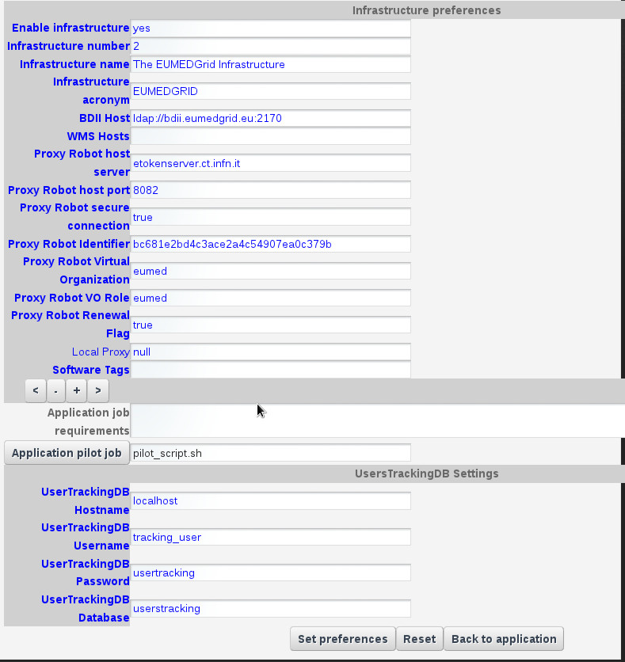

*********************
MOLON v1.0.1 Docs
*********************

============
About
============

Molon portet (MOLar absortiON coefficient) calculates the molar absorption coefficient for a number of molecules. To do so, it gathers information from the MPI-Mainz database, available at http://satellite.mpic.de/spectral_atlas .

The numerical data is available in ASCII format and contains two columns: the first column gives the wavelength ? (in nm) (generally in air unless vacuum wavelengths are indicated); the second column contains the absorption cross section ? (in cm2 molecule-1) or quantum yield (dimensionless).

This information is downloaded and processed by Molon to in order to calculate the molar absortion coeffient, which is then presented to the user in a single text file. Molon makes usage of PID service to store the URL corresponding to the database location. This way, the user only needs to include the molecule he wants to process, and the system will automatically convert that information into the corresponding text file, which is then downloaded by the portlet.

============
Installation
============
To install the MOLON portlet the WAR file has to be deployed into the application server.

As soon as the portlet has been successfully deployed on the Science Gateway the administrator has to configure:

- the list of e-Infrastructures where the application can be executed;

- some additional application settings.

1.) To configure a generic e-Infrastructure, the following settings have to be provided:

**Enabled**: A true/false flag which enables or disable the generic e-Infrastructure;

**Infrastructure**: The acronym to reference the e-Infrastructure;

**VOName**: The VO for this e-Infrastructure;

**TopBDII**: The Top BDII for this e-Infrastructure;

**WMS Endpoint**: A list of WMS endpoint for this e-Infrastructure (max. 10);

**MyProxyServer**: The MyProxyServer for this e-Infrastructure;

**eTokenServer**: The eTokenServer for this e-Infrastructure;

**Port**: The eTokenServer port for this e-Infrastructure;

**Serial Number**: The MD5SUM of the robot certificate to be used for this e-Infrastructure;

**WebDAV**: The EMI-3 DPM Grid Storage Element, with WebDAV interface, to be used for this e-Infrastructure;

In the following figure is shown how the portlet has been configured to run simulation on the EUMEDGRID-Support e-Infrastructure.

2.) To configure the application, the following settings have to be provided:

**AppID**: The ApplicationID as registered in the UserTracking MySQL database (GridOperations table);

**Log Level**: The log level for the application (e.g.: *INFO* or *VERBOSE*);

**Metadata Host**: The Metadata hostname where download/upload digital-assets (e.g. *glibrary.ct.infn.it*);

**Software TAG**: The list of software tags requested by the application;

**SMTP Host**: The SMTP server used to send notification to users;

**Sender**: The FROM e-mail address to send notification messages about the jobs execution to users;

.. _CHAIN-REDS: https://science-gateway.chain-project.eu/
.. _gLibrary: https://glibrary.ct.infn.it/

In the figure below is shown how the application settings have been configured to run on the CHAIN-REDS_ Science Gateway.

.. image:: images/settings2.jpg
   :align: center

============
Usage
============

To run the MOLON simulation the user only needs to choose the input data source: an URL, a PID or a local file. The application will then be executed remotely and the result presented to the user as a tar.gz file. 

.. image:: images/input.jpg
   :align: center

Each run will produce:

- std.txt: the standard output file;

- std.err: the standard error file;

- .tar.gz: the application results 

============
References
============

.. _1: http://agenda.ct.infn.it/event/1110/

* CHAIN-REDS Conference: *"Open Science at the Global Scale: Sharing e-Infrastructures, Sharing Knowledge, Sharing Progress"* – March 31, 2015 – Brussels, Belgium [1_];

============
Support
============
Please feel free to contact us any time if you have any questions or comments.

.. _Sci-Track: http://rdgroups.ciemat.es/web/sci-track/
.. _INFN: http://www.ct.infn.it/

:Authors:
 `Manuel RODRIGUEZ-PASCUAL <mailto:manuel.rodriguez@ciemat.es>`_ - CIEMAT Sci-Track

:Version: v1.0.0, 2015

:Date: Jun 1th, 2015
